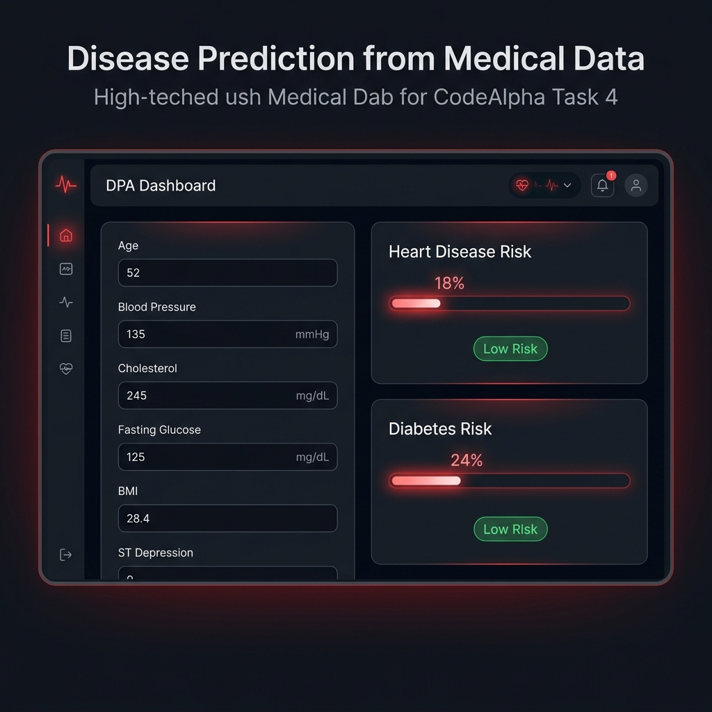
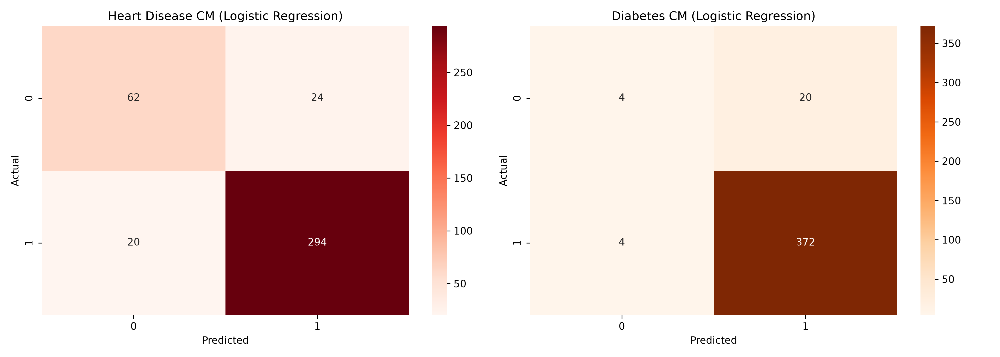

# Task 4: Disease Prediction from Medical Data — CodeAlpha Machine Learning Internship



## 📌 Project Overview
This project delivers a multi-condition clinical risk prediction platform for **Heart Disease & Diabetes**, developed for the **CodeAlpha Machine Learning Internship**.

Using patient clinical measurements (blood pressure, fasting glucose, serum cholesterol, BMI, oldpeak, max heart rate), the system applies classification models to predict patient risk profiles.

---

## 🚀 Key Features
- **Multi-Disease Diagnostic Architecture**: Concurrent estimation of Heart Disease & Diabetes risk.
- **Algorithms Evaluated**: **SVM (Support Vector Classifier)**, **Logistic Regression**, **Random Forest**, and **XGBoost**.
- **Metrics Evaluated**: Precision, Recall, F1-Score, ROC-AUC curve performance, Confusion Matrices.
- **Interactive Medical Dashboard**: Web application featuring real-time risk gauges, diagnostic pills, and clinical input sliders.

---

## 📊 Confusion Matrices & Performance


---

## 🛠️ Installation & Setup

1. **Install Dependencies**:
   ```bash
   pip install -r requirements.txt
   ```

2. **Generate Medical Dataset & Train Models**:
   ```bash
   python train_model.py
   ```

3. **Launch Medical Risk Web Application**:
   ```bash
   python app.py
   ```
   Access `http://localhost:5003` in your browser.

---

Developed for **CodeAlpha Machine Learning Internship**.
